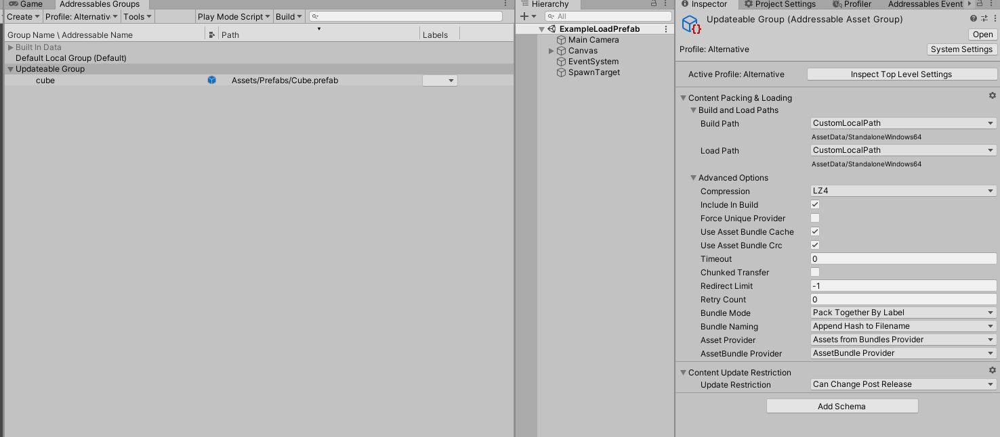
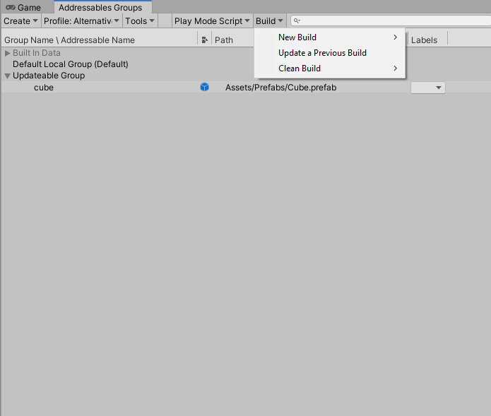

# Addressable Asset with UniRx


## **Prerequisite**

- Unity 2020.1.6f1
- Addressables 1.8.5
- [UniRx](https://github.com/neuecc/UniRx)

## What is UniRx
- UniRx (Reactive Extensions for Unity) is a reimplementation of the .NET Reactive Extensions. Please Go to [UniRx](https://github.com/neuecc/UniRx) to check it out.

## How to Use Addressable

- Please go to [Getting started](https://docs.unity3d.com/Packages/com.unity.addressables@1.8/manual/AddressableAssetsGettingStarted.html) for more details.

## How to Setup Addressable

- Go to **Window** > **Asset Management** > **Addressables** > **Groups** to open the **Addressables Groups** window.

- Select **Addressables Groups** and modify property in **Inspector**.

  - Look at the **Build and Load Paths** section this is the setting section for set the build and load path for your Addressable Asset.
  
  

- You can set **Addressable Profile** by go to **Window** > **Asset Management** > **Addressables** > **Profiles** to open the **Addressables Profiles** window.

- To use build assets in Editor In **Addressables Groups** window Click on **Play Mode Script** > **Use Existing Build (requires built groups)** this is most closely matches a deployed application build. See [AddressableAssetsDevelopmentCycle](https://docs.unity3d.com/Packages/com.unity.addressables@1.8/manual/AddressableAssetsDevelopmentCycle.html) for more details.

- If you want to use Remote server and load asset from remote please check this [【Unity Addressables Tutorial】How to update content on build from remote path](https://www.youtube.com/watch?v=KJbNsaj1c1o) Youtube video.

## How to Build / Update Addressable Asset

- Go to **Window** > **Asset Management** > **Addressables** > **Groups** to open the **Addressables Groups** window.

- If you want to build new Addressable Assets.
	
  - Click on **Build** > **New Build** > **Default Build Script** to build new Addressable Assets Build.
  
- If you want to update previous Addressable Assets.
	
  - Click on **Build** > **Update a Previous Build** to browse and update Addressable Assets Build.
  
- New / Update build will be appear in **Build Path** you were set in **How to Setup Addressable** section.

***Note In case you want to update new asset or after modify exist Addressable Asset. Use Update a Previous Build only to update the asset, otherwise your application will not be able to use updated Addressable Asset***.

  

## How to use scripts

- To load asset Use `AddressableManager.GetAssetAsObservable(_addressKey)` to load the asset.

```c#
  AddressableManager
                  .GetAssetAsObservable(_addressKey)
                  .Subscribe(_ =>
                  {
                      if (LoadedAsset && !m_AssetAddressKey.Equals(_addressKey))
                          Release(LoadedAsset);
  
                      LoadedAsset = _;
                      m_AssetAddressKey = _addressKey;
                      OnLoadedComplete?.Invoke(_);
                      IsLoading.Value = false;
                  }, Debug.LogError)
                  .AddTo(this);
```
- To instantiate prefab asset Use `AddressableManager.InstantiateAsObservable(_addressKey)` to instantiate the prefab asset.
```c#
AddressableManager
                .InstantiateAsObservable(_addressKey)
                .Subscribe(_ =>
                {
                    if (LoadedAsset && !m_AssetAddressKey.Equals(_addressKey))
                        Release(LoadedAsset);

                    LoadedAsset = _;
                    m_AssetAddressKey = _addressKey;
                    OnLoadedComplete?.Invoke(_);
                    IsLoading.Value = false;
                }, Debug.LogError)
                .AddTo(this);
```

- Every methods above already implement in `AddressableObject` script.

  - In any case when you want to load Unity asset, just create a derive class that inherit from abstract class `AddressableObject` like example below.
  - In the example, it's load TMP_FontAsset as addressable asset.

  - Note the `LoadCompleted` method, this is a abstract method that you must to implement into derived class to do an action with loaded asset. In this case the script just assign font asset to `_Text`.

```c#
public class FontLoad : AddressableObject
{
    private TextMeshProUGUI _Text;

    protected override void LoadCompleted(Object _loadedAsset)
    {
        _Text = _Text ?? GetComponent<TextMeshProUGUI>();
        _Text.font = (TMP_FontAsset) _loadedAsset;
    }
}
```

***Note AddressableManager and AddressablerObject have some problem when the game object that contains the loaded asset has been destroyed, and there are other game objects still sharing the loaded asset. There will cause the problem because the loaded asset will be missing.***

## Example Scenes

- **ExampleFontLoad** - Example to load Addressable Asset as `TMP_FontAsset` in runtime.
- **ExampleImageLoad** - Example to load Addressable Asset as `Texture2d` in runtime.
- **ExamplePrefabLoad** - Example to instantiate Addressable Asset as `GameObject` in runtime.


## Contributing
- Feel free to create pull request for contribution.
